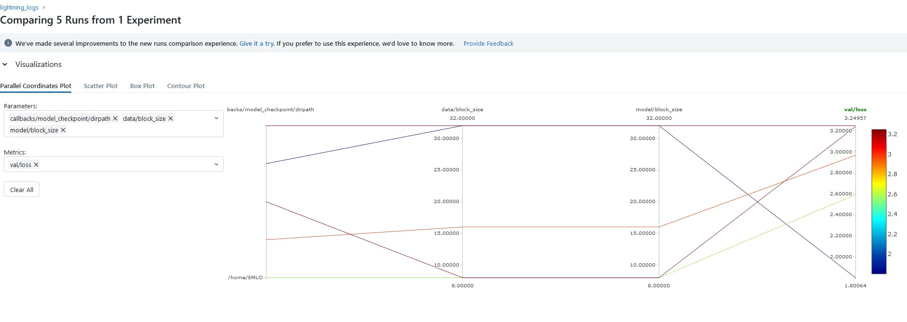
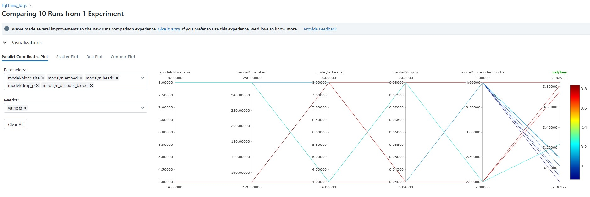

# EMLOv3 | Assignment 7

[](https://pytorch.org/get-started/locally/)
[](https://pytorchlightning.ai/)
[](https://hydra.cc/)
[](https://black.readthedocs.io/en/stable/)


## Hyperparameter Optimization using <b>Optuna</b>
The module is called <em>'gold'</em>.
This module supports optimiztion for following parameters (for GPT model):

    block_size
    n_embed
    n_heads
    drop_p
    n_decoder_blocks : This is the number of GPTDecoderBlock used in self.blocks of GPT

The search space is defined in the yaml file in hparams_search in configs. The data used is Harry patter books consolidated.


## To run

1. Git clone this repo

```
git clone https://github.com/jha-vikas/EMLO_session07-HParam-Optimization
```

2. Move inside the repor fodler
```
cd EMLO_session07-HParam-Optimization
```

3. Install requirements & gold moduel
```
pip install -r requirements.txt && pip install -e .
```

4. Use tuner to get best LR & batch size.
   Run LR_and_Batch_size_finder.ipynb from notebooks folder with required changes.

5. Train (Adjust parameters of batch_size, num_workers & LR)
```
gold_train data.batch_size=1024 data.num_workers=2 model.learning_rate=0.001
```


### Best hyperparameters & loss(val) value:
```
block_size: 8
n_embed: 256
n_heads: 4
drop_p: 0.08
n_decoder_blocks: 4

Best val/loss value: 2.864
```

- In inital runs, n_heads of 8, 16 & 32 were also considered. However, with 32 as head & 256 as embedding size, with A6000 as GPU, it took 2+ hrs for one iteration. Hence, it was stopped and a smaller number of iteration and reduced values of heads were considered.
- Inital startup trials considered: 5
- Total trials: 10
- Time taken: ~4.5 hrs
- Result comparison between runs:

### Intial run (partial as it was consuming too much resources)


### Final run (All 10 runs completed)



## Author

- Vikas Jha
